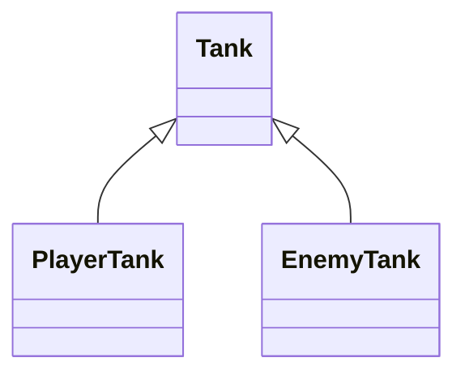
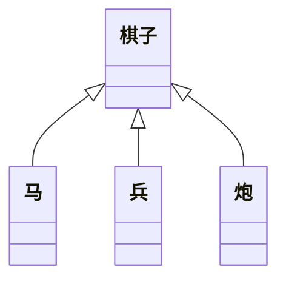

### 面向对象

- 是一种思想，一种编程思想

### 类的继承

#### 继承的作用

- 继承可以描述类与类的关系
- 如果 A 和 B 都是类，并且可以描述 A 是 B，则 A 和 B 形成继承关系
  - B 是父类，A 是子类
  - B 派生 A，A 继承自 B
  - B 是 A 的基类，A 是 B 的派生类
- 如果 A 继承自 B，A 自动拥有 B 的所有成员

#### 成员的重写

- 子类的成员覆盖父类成员，子类成员不能改变父类成员的类型
- 无论是函数还是成员，都可以覆盖重写，但类型要匹配
- this 关键字：在继承关系中，this 的指向是动态的，调用方法时，根据调用者来确定指向
- super 关键字：在子类中，可以使用 super 关键字读取父类成员
  - 与 this 的区别，this 先找自身，没有再去找父类
  - super 始终指向父类

#### 类型匹配

- 鸭子辨型法
  - 子类的对象，可以赋值给父类（还是少点用）
- 面向对象中，这种现象，叫做里氏替换原则
- instanceof，判断

#### protected 修饰符

- readonly
- 访问 i 权限修饰符
  - private
  - public
  - protected：自身与子类可以访问

#### 继承的传递性和单根性

- 单根性：每个类只能拥有一个父类
- 传递性：如果 A 是 B 的父类，B 是 C 的父类，则 A 也是 C 的父类

### 抽象类

#### 为什么需要抽象类

- 不具体创建实例，只用于描述一些概念的类
- 关键字 `abstract`

#### 抽象成员

- 父类中，有些成员是必须存在的，但不知道该成员的值或者实现是什么，因此需要有一种强约束，让该类的子类必须实现该成员
- 抽象成员只能存在于抽象类中
- 抽象成员必须在子类中实现

### 设计模式-模板模式（工厂）

面对一些常见的功能场景，有一些固定的、经过多年实践的成熟方法，这些方法称为设计模式

#### 模板模式

有些方法，在子类中实现的方法流程完全一致，只是流程中的某个步骤具体实现不一样，可以讲该方法提取到父类，在父类中完成整个流程的实现

### 静态成员

- 静态成员
  - 是指附着在类上的成员（属于某个构造函数的成员）
  - 使用`static`关键字进行修饰
  - 非实例成员
- 实例成员
  - 实例对象能访问的成员

#### 静态方法中的 this

- 实例方法的 this 指向**当前实例对象**
- 静态方法中的 this 指向**当前类**

### 设计模式-单例模式

单例模式：某些类的对象，在系统中最多只能有一个对象，为了避免开发中造成随意创建多个类对象的错误，可以使用单例模式进行强约束。

### 接口拓展

接口：用于约束类、对象、函数，是一个类型契约

`implements`

### 索引器

- `对象[name]`, 成员表达式
- 在 TS 中，默认不对索引器做严格类型检查
  - 可以使用配置`noImplicitAny`开启对隐式 any 的检查
  - 隐式 any：TS 根据实际情况推导出的 any 类型
- 在索引器中，键的类型可以是字符串，也可以是数字
- 在类中，索引器书写的位置要在所有成员之前
- TS 中索引器的作用
  - 在严格检查下，可以实现为类动态增加成员
  - 可以实现动态操作类成员
- TS 中，所有的成员名本质上，都是字符串，如果使用数字作为成员名，会自动转换为字符串
- TS 中，如果某个类使用两种类型的索引器，要求这两个索引器的值类型必须一样

### this 指向约束

#### JS 中的 this

- 明确：大部分情况下，this 的指向取决于函数的调用方式
  - 如果直接调用函数（全局调用），this 指向全局对象或 undefined（启用严格模式）
  - 如果使用`[对象].[方法]`方式调用，this 指向对象本身
  - 如果是 dom 事件的处理函数，this 指向事件处理对象
- 特殊情况：
  - 箭头函数，this 在声明的时候确定指向，指向函数位置的 this
  - 使用 bind、apply、call 手动绑定 this 对象

#### TS 中的 this

- 配置`noimplicitThis`为 true, 表示不允许 this 隐式地指向 any
- TS 中，允许在书写函数时，手动声明该函数的 this 的指向，将 this 作为函数的第一个参数，该参数只用于约束 this，并不是真正的参数，也不会出现在编译结果中

### 装饰器

> 面向对象的概念（Java：注解，c#：特征）
> decorator
> angular 大量使用，react 中也使用
> 目前 JS 支持装饰器，目前处于建议征集的第二阶段

#### 解决的问题

装饰器，分离关注点。

- 关注的问题：在定义某个东西时，也是最清楚该东西情况的时候。
- 重复代码的问题。

上述两个问题产生的根源：某些信息在定义时，能够附加的信息量有限。  
装饰器的作用：为某些属性、类、参数、方法提供元数据信息（metadata）。  
元数据：描述数据的数据。

#### 装饰器的本质

在 JS 中，装饰器是一个函数。（因此装饰器是要参与运行的）
装饰器可以修饰：

- 类
- 成员（属性+方法）
- 参数

#### 类装饰器

- 类装饰器的本质是一个函数，该函数接收一个参数，表示类本身（构造函数本身）。
  - 需要一个参数，参数为类本身
- 使用装饰器`@函数`
- 在 TS 中，如何约束一个变量为类：
  - Function
  - new (参数)=>object
- 在 TS 中使用装饰器，需要开启配置`experimentalDecorators`。
- 装饰器函数的运行时间：
  - 在类定义后直接运行。
- 类装饰器可以具有的返回值：
  - void
  - 一个新类，会替换掉装饰目标
- 多个装饰器运行情况：从下往上的顺序

#### 成员装饰器

- 属性
  - 属性装饰器也是一个函数，该函数需要两个参数：
    - 参数 1：如果是静态属性，则为类本身；如果是实例属性，则为类的原型（prototype）；
    - 参数 2：固定为一个字符串，表示属性名；
- 方法
  - 方法装饰器也是一个函数，需要三个参数：
    - 参数 1： 如果静态方法，则为类本身；如果是实例方法，则为类的原型；
    - 参数 2： 固定为一个字符串，表示方法名；
    - 参数 3： 属性描述符对象

#### 练习：类和属性的描述装饰器

- 类
- 装饰器
