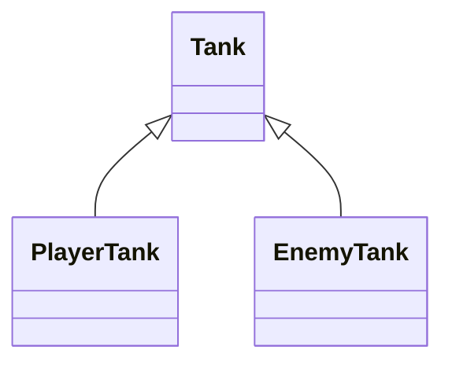
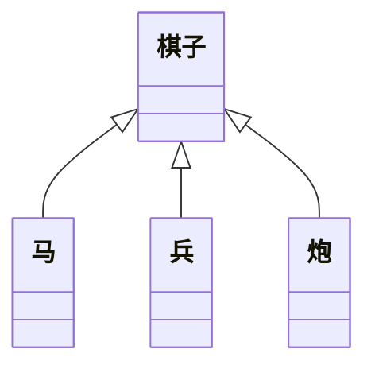

### 面向对象

- 是一种思想，一种编程思想

### 类的继承

#### 继承的作用

- 继承可以描述类与类的关系
- 如果 A 和 B 都是类，并且可以描述 A 是 B，则 A 和 B 形成继承关系
  - B 是父类，A 是子类
  - B 派生 A，A 继承自 B
  - B 是 A 的基类，A 是 B 的派生类
- 如果 A 继承自 B，A 自动拥有 B 的所有成员

#### 成员的重写

- 子类的成员覆盖父类成员，子类成员不能改变父类成员的类型
- 无论是函数还是成员，都可以覆盖重写，但类型要匹配
- this 关键字：在继承关系中，this 的指向是动态的，调用方法时，根据调用者来确定指向
- super 关键字：在子类中，可以使用 super 关键字读取父类成员
  - 与 this 的区别，this 先找自身，没有再去找父类
  - super 始终指向父类

#### 类型匹配

- 鸭子辨型法
  - 子类的对象，可以赋值给父类（还是少点用）
- 面向对象中，这种现象，叫做里氏替换原则
- instanceof，判断

#### protected 修饰符

- readonly
- 访问 i 权限修饰符
  - private
  - public
  - protected：自身与子类可以访问

#### 继承的传递性和单根性

- 单根性：每个类只能拥有一个父类
- 传递性：如果 A 是 B 的父类，B 是 C 的父类，则 A 也是 C 的父类

### 抽象类

#### 为什么需要抽象类

- 不具体创建实例，只用于描述一些概念的类
- 关键字 `abstract`

#### 抽象成员

- 父类中，有些成员是必须存在的，但不知道该成员的值或者实现是什么，因此需要有一种强约束，让该类的子类必须实现该成员
- 抽象成员只能存在于抽象类中
- 抽象成员必须在子类中实现

### 设计模式-模板模式（工厂）

面对一些常见的功能场景，有一些固定的、经过多年实践的成熟方法，这些方法称为设计模式

#### 模板模式

有些方法，在子类中实现的方法流程完全一致，只是流程中的某个步骤具体实现不一样，可以讲该方法提取到父类，在父类中完成整个流程的实现

### 静态成员

- 静态成员
  - 是指附着在类上的成员（属于某个构造函数的成员）
  - 使用`static`关键字进行修饰
  - 非实例成员
- 实例成员
  - 实例对象能访问的成员

#### 静态方法中的 this

- 实例方法的 this 指向**当前实例对象**
- 静态方法中的 this 指向**当前类**

### 设计模式-单例模式

单例模式：某些类的对象，在系统中最多只能有一个对象，为了避免开发中造成随意创建多个类对象的错误，可以使用单例模式进行强约束。
